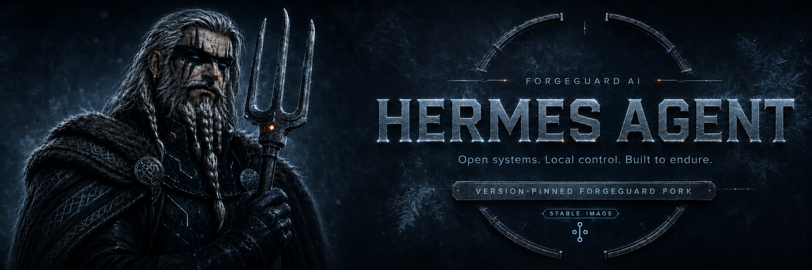
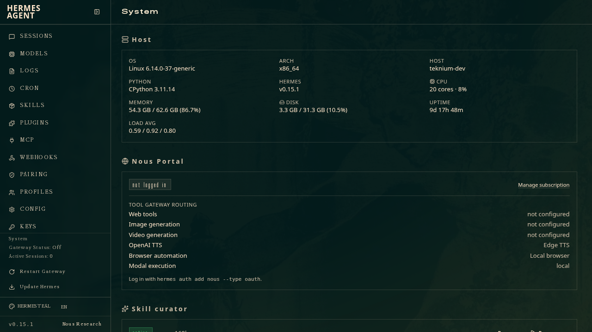
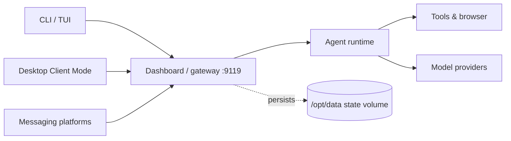

<div align="center">
  

<br>
<br>

<a href="./docs/site/index.md"></a>
<a href="https://github.com/forgeguard-ai/hermes-agent/releases"></a>
<a href="https://github.com/orgs/forgeguard-ai/packages?repo_name=hermes-agent"></a>
<a href="https://hermes-agent.nousresearch.com/docs/"></a>
<a href="./SECURITY.md"></a>
<a href="./LICENSE"></a>

**A ForgeGuard-maintained distribution of [Hermes Agent](https://hermes-agent.nousresearch.com/docs/) — the self-improving AI agent built by [Nous Research](https://nousresearch.com) — packaged as versioned runtime and CLI container images and desktop installers.**

[ForgeGuard docs](./docs/site/index.md) ·
[Quick start](#quick-start) ·
[Deployment](./docs/site/deployment/runtime-images.md) ·
[Releases](https://github.com/forgeguard-ai/hermes-agent/releases) ·
[Upstream docs](https://hermes-agent.nousresearch.com/docs/)

</div>

> [!IMPORTANT]
> **ForgeGuard maintained fork of [`NousResearch/hermes-agent`](https://github.com/NousResearch/hermes-agent).**
> ForgeGuard tracks tagged upstream releases and publishes versioned runtime/CLI images and desktop artifacts. Core Hermes behavior and product documentation remain upstream-owned.
>
> [ForgeGuard changes](./docs/site/fork/forgeguard-changes.md) · [Compatibility](./docs/site/fork/compatibility.md) · [Upstream documentation](https://hermes-agent.nousresearch.com/docs/)

## Overview

Hermes Agent is the self-improving AI agent built by [Nous Research](https://nousresearch.com).
It creates skills from experience and improves them during use, curates its own
memory, searches its past conversations, and builds a model of who you are across
sessions. It runs on a $5 VPS, a GPU cluster, or serverless infrastructure that
costs nearly nothing when idle, and it isn't tied to your laptop — you can talk
to it from Telegram, Discord, Slack, WhatsApp, or Signal while it works on a
cloud machine. Use any model provider you want, and switch with a single command.
The upstream product — the agent runtime, providers, tools, messaging gateway,
security model, and desktop app — is owned, maintained, and documented by Nous
Research at **[hermes-agent.nousresearch.com](https://hermes-agent.nousresearch.com/docs/)**.

**ForgeGuard** maintains a distribution of that product. It syncs to upstream
**tagged releases** and adds a packaging and release overlay: versioned
`runtime-*` and `cli-*` container images on GitHub Container Registry, and Linux
and macOS desktop installers attached to each fork release. ForgeGuard does not
change how the agent behaves — it packages and ships it. This README and the
[`docs/site/`](./docs/site/index.md) documentation cover the ForgeGuard artifacts;
for how Hermes itself works, follow the links to the upstream product docs.

The distribution is built for operators who want reproducible, pinnable Hermes
deployments rather than a one-off local install. Each release produces immutable
image tags and desktop installers tied to a specific upstream base, so a
deployment can pin an exact version and upgrade deliberately. The runtime image
keeps an immutable install tree separate from a durable state volume, so
upgrading is pulling a newer tag and recreating the container — your
configuration, sessions, memory, and skills persist untouched. The result is a
Hermes you can run on a small VPS or self-hosted Docker host and manage the way
you manage any other versioned service, while the agent itself, and everything it
can do, remains the upstream product.

## Choose your installation

| Path | Intended use | Where |
|---|---|---|
| **Upstream native installer** | Install Hermes directly on your machine — `install.sh` for Linux/macOS/WSL2, `install.ps1` (PowerShell) for native Windows (the canonical, fully upstream-supported path) | [Upstream quickstart](https://hermes-agent.nousresearch.com/docs/getting-started/quickstart) |
| **ForgeGuard runtime image** | A persistent, supervised server with a web dashboard and durable state | [Runtime images](./docs/site/deployment/runtime-images.md) |
| **ForgeGuard CLI image (distrobox)** | An interactive terminal install with host integration, containerised | [Distrobox / CLI image](./docs/site/deployment/distrobox-cli.md) |
| **ForgeGuard desktop installers** | Prebuilt Linux / macOS builds of the Hermes Desktop app | [Desktop artifacts](./docs/site/deployment/desktop-artifacts.md) |

ForgeGuard's artifacts exist for persistent container deployments, containerised
CLI use, and prebuilt desktop installers — they do not replace the upstream
installer as the canonical way to install Hermes on your own machine.

## Quick start

Run a persistent Hermes server from the ForgeGuard runtime image. Prefer an
immutable `runtime-<release>` tag for anything durable, mount a state volume, and
configure dashboard authentication — it is **required** on non-loopback binds:

```bash
docker run -d \
  --name hermes \
  --restart unless-stopped \
  -v ~/.hermes:/opt/data \
  -p 9119:9119 \
  -e HERMES_DASHBOARD=1 \
  -e HERMES_DASHBOARD_BASIC_AUTH_USERNAME=admin \
  -e HERMES_DASHBOARD_BASIC_AUTH_PASSWORD="$(openssl rand -hex 24)" \
  -e HERMES_DASHBOARD_BASIC_AUTH_SECRET="$(openssl rand -hex 32)" \
  -e HERMES_UID="$(id -u)" -e HERMES_GID="$(id -g)" \
  ghcr.io/forgeguard-ai/hermes-agent:runtime-v0.19.0 gateway run
```

Verify it is up:

```bash
curl --fail http://localhost:9119/api/status
```

State on `~/.hermes` is durable — upgrading is pulling a newer tag and recreating
the container. See [Runtime images](./docs/site/deployment/runtime-images.md),
[Dashboard authentication](./docs/site/operations/dashboard-authentication.md),
and [Releases and upgrades](./docs/site/operations/releases-and-upgrades.md) for
the full guide.

<div align="center">
  
</div>

## Architecture

At a high level, client channels — the CLI and TUI, the desktop app's Client
Mode, and the messaging platforms — all reach the agent through the
dashboard/gateway backend on port `9119`. That backend drives the agent runtime,
which in turn calls tools (including the bundled browser) and whichever model
providers you configure. Durable state — configuration, secrets, sessions,
memory, skills, and profiles — lives on the mounted `/opt/data` volume, cleanly
separated from the immutable install tree at `/opt/hermes`. In the runtime image,
s6-overlay supervises the dashboard and per-profile gateways so they restart on
crash and are restored after a host reboot. The meaningful trust boundary for
untrusted input is whole-process / OS isolation — the container and host boundary —
as described in the upstream
[security guide](https://hermes-agent.nousresearch.com/docs/user-guide/security);
ForgeGuard does not weaken that model.



## Documentation

**ForgeGuard distribution docs** — the runtime and CLI images, desktop
installers, releases, persistence, and authentication:

- [ForgeGuard documentation home](./docs/site/index.md)
- [Choose a ForgeGuard artifact](./docs/site/getting-started/choose-a-forgeguard-artifact.md)
- [Deployment](./docs/site/deployment/runtime-images.md) ·
  [Operations](./docs/site/operations/dashboard-authentication.md) ·
  [Reference](./docs/site/reference/image-tags.md) ·
  [Troubleshooting](./docs/site/troubleshooting/forgeguard-artifacts.md)
- [Understanding the fork](./docs/site/fork/forgeguard-changes.md)

**Upstream product docs** — how Hermes itself works (configuration, providers,
skills, memory, the messaging gateway, security):
**[hermes-agent.nousresearch.com/docs](https://hermes-agent.nousresearch.com/docs/)**.

Translated READMEs — [中文](README.zh-CN.md) · [اردو](README.ur-pk.md) ·
[Español](README.es.md) — are upstream-owned and describe the upstream product;
they may not reflect ForgeGuard artifacts or the current fork release.

## Compatibility and releases

ForgeGuard releases are tagged with the Hermes product version they ship (e.g.
`v0.19.0`; a re-cut of an already-released version adds a `-forgeguard.<n>`
suffix). The current fork ships Hermes **`0.19.0`** and tracks upstream
**`v2026.7.20`**, recorded in the [`FORK_UPSTREAM_BASE`](./FORK_UPSTREAM_BASE)
marker and surfaced in each release's notes. Runtime and CLI images
are published to `ghcr.io/forgeguard-ai/hermes-agent` with immutable
`*-<version>` and `*-<git-sha>` tags plus rolling `*-latest` tags; pin an
immutable tag for durable deployments. Images are built for `linux/amd64`;
desktop builds cover Linux (`.AppImage`/`.deb`/`.rpm`) and macOS (`.dmg`/`.zip`,
ad-hoc signed and **not** notarized). This fork advances quickly — always confirm
against the live marker and the newest [release](https://github.com/forgeguard-ai/hermes-agent/releases).
See [Compatibility](./docs/site/fork/compatibility.md).

## Support

Report problems with **ForgeGuard artifacts** (the GHCR images, desktop
installers, release/versioning, or ForgeGuard-only container behaviour) to
[`forgeguard-ai/hermes-agent`](https://github.com/forgeguard-ai/hermes-agent/issues).
Report bugs in **Hermes itself** — behaviour reproducible on an upstream install —
to [`NousResearch/hermes-agent`](https://github.com/NousResearch/hermes-agent/issues).
Nous Research does not provide support for ForgeGuard-specific builds. See
[SUPPORT.md](./SUPPORT.md) for the full boundary.

## Security

Do not report suspected vulnerabilities through a public issue. Follow
[SECURITY.md](./SECURITY.md): ForgeGuard artifact and packaging issues route to
ForgeGuard's private advisories, and upstream product vulnerabilities follow the
upstream policy. The meaningful security boundary for untrusted input is
whole-process / OS isolation — see the upstream
[security guide](https://hermes-agent.nousresearch.com/docs/user-guide/security).

## Contributing

Contributions to the ForgeGuard overlay are welcome — review
[CONTRIBUTING.md](./CONTRIBUTING.md) before opening a pull request, and note that
upstream product contributions belong to `NousResearch/hermes-agent`. Maintainer
procedures (release process, artifact verification, and the upstream-sync
runbook) live under [`docs/maintainers/`](./docs/maintainers/).

## License

Hermes Agent is licensed under the [MIT License](./LICENSE), copyright
Nous Research. ForgeGuard preserves that license and attribution;
ForgeGuard-authored additions (the packaging overlay, release automation, and
this documentation) are identified in the repository history. ForgeGuard does not
claim upstream sponsorship or endorsement of its distribution-specific builds.

Built by [Nous Research](https://nousresearch.com). Distribution maintained by
[ForgeGuard AI](https://github.com/forgeguard-ai).
