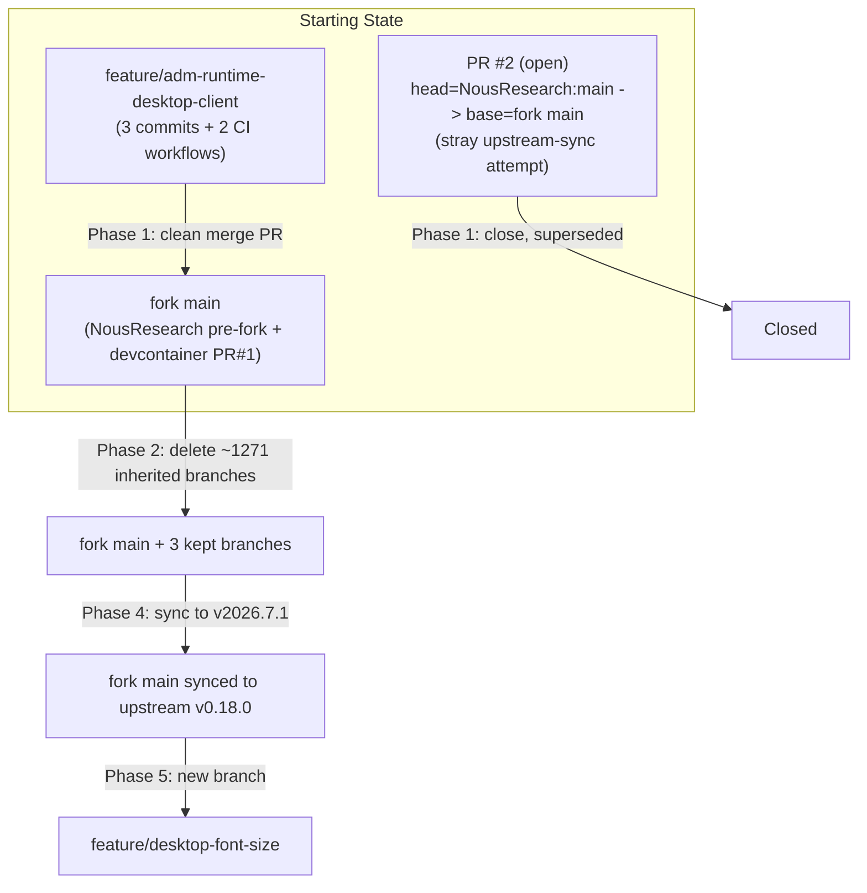

# ForgeGuard Fork Consolidation Plan

This is the durable, checkbox-tracked copy of the plan approved on 2026-07-02.
Update the checkboxes below as work completes so this file stays the source of
truth if work pauses or moves to a different agent/session.

## Key findings from research (context for every phase below)

- **Remotes:** `origin` = `ForgeGuard/hermes-agent` (your fork, public), `upstream` = `NousResearch/hermes-agent`.
- **`feature/adm-runtime-desktop-client`** has exactly 3 commits ahead of fork `main` (all authored by `paul-forgeguard <paul@forgeguard.ai>`): connection-mode dialog, first-run local/remote choice, and opt-in TLS bypass. This branch also already contains two fork-only CI workflows not yet on `main`: `.github/workflows/build-adm-runtime-image.yml` (publishes `ghcr.io/forgeguard/hermes-agent:adm-*`) and `.github/workflows/build-desktop-client.yml` (Linux-only desktop installers today). `git merge-tree` confirmed a clean, conflict-free merge into `main`.
- **Fork `main`** is `NousResearch main (pre-fork snapshot) + PR #1 (feat/devcontainer)` — the devcontainer branch is already merged into fork main.
- **The pasted CI failure** (`joeykerp@gmail.com` unmapped) belonged to an already-open, out-of-order PR: **ForgeGuard/hermes-agent#2**, head = `NousResearch:main` (100+ commits / 73k+ line diff) → base = fork `main`. This was a premature, ad-hoc attempt at the "sync upstream" work (item 4). Decision: close it and redo the sync properly, later, targeting the `v2026.7.1` tag.
- **Root cause, generalized:** `contributor-check` (`.github/workflows/contributor-check.yml`, invoked from `.github/workflows/ci.yml` line 91) checks every new commit's author email against `AUTHOR_MAP` in `scripts/release.py`. That map is NousResearch's own external-contributor credit ledger — `paul@forgeguard.ai` will never be in it, so this job would fail on every future PR merged into the fork's own main. Fix: gate it off for the fork, the same way `docker.yml` already does for its Docker-Hub-publish job (`if: github.repository == 'NousResearch/hermes-agent'`).
- **Branches:** the fork had **1274 remote branches** total — nearly all of NousResearch's own active dev/salvage/dependabot/feature branches, inherited from "fork with all branches." Fork-owned branches are only `main`, `feature/adm-runtime-desktop-client`, and `feat/devcontainer` (merged). Everything else is deleted.
- **Upstream sync target:** tag `v2026.7.1` ("Hermes Agent v0.18.0 — The Judgment Release", cut 2026-07-01). `upstream/main` was 17 commits past this tag at plan time; sync targets the tagged release specifically, not the moving tip.
- **Desktop font size:** the Electron app already implements full-window zoom (`Cmd/Ctrl +/-/0`) in `apps/desktop/electron/main.cjs` (`setAndPersistZoomLevel`, persisted to `localStorage['hermes:desktop:zoomLevel']`), it's just not exposed anywhere in Settings. Future work surfaces this as an explicit control, not a parallel CSS font-scale system.
- **ADM context** (read from the private `ForgeGuard/agent-deployment-manager` repo, `docs/hermes-fork-runtime-plan.md` + `docs/remote-deployment-plan.md`): ADM expects exactly **one** shared runtime image (`ghcr.io/forgeguard/hermes-agent:adm-*`) for both local-distrobox and remote-docker-standalone deployment kinds.

## Phase 0 — Save this plan (do this first, before any other step)

- [x] Create `docs/agent-plans/` directory.
- [x] Write this plan to `docs/agent-plans/2026-07-02-forgeguard-fork-consolidation-plan.md`.
- [ ] Update `AGENTS.md` with two new "ForgeGuard fork only" sections: fork PR policy + plan-saving rule.
- [ ] Create `CLAUDE.md` at repo root as a pointer to `AGENTS.md`.
- [ ] Create `.github/copilot-instructions.md` as a pointer to `AGENTS.md`.

## Phase 1 — Fix CI, merge the feature branch, add release automation

- [ ] Close PR #2 on `ForgeGuard/hermes-agent` with an explanatory comment.
- [ ] Gate `contributor-check` to upstream-only in `.github/workflows/ci.yml` (`if: github.repository == 'NousResearch/hermes-agent'`).
- [ ] Open and merge a PR: `feature/adm-runtime-desktop-client` → fork `main` (merge commit, not squash/rebase). Confirm CI green.
- [ ] Extend `build-desktop-client.yml` with a macOS job (unsigned `dist:mac`). No Windows job yet.
- [ ] Create `release-on-merge.yml`: trigger on PR merged to `main`, build desktop (Linux+macOS) + ADM runtime image, version as `<upstream-tag>-forgeguard.<n>`, publish a GitHub Release with installers attached and image tags referenced.
- [ ] Add a "Docker (ForgeGuard fork)" quickstart section to `README.md`.
- [ ] Checkpoint: optional pause here to test release automation end-to-end before branch pruning.

## Phase 2 — Prune inherited branches

- [ ] Enumerate all remote branches on `ForgeGuard/hermes-agent`.
- [ ] Delete every branch except `main`, `feature/adm-runtime-desktop-client`, `feat/devcontainer`.
- [ ] Confirm `upstream` remote and any NousResearch branch are still fetchable on demand (nothing lost).

## Phase 3 — Confirm devcontainer already merged

- [ ] Verify `.devcontainer/` present on fork `main` post-Phase-1-merge (already merged via PR #1; sanity check only).

## Phase 4 — Sync fork main to upstream v2026.7.1 + write the reusable sync skill

- [ ] Merge `upstream` tag `v2026.7.1` into fork `main` via a `sync/upstream-v2026.7.1` branch → PR, re-applying fork-only patches (contributor-check guard, ADM/desktop-client workflows, release workflow, README docker section).
- [ ] Write a `FORK_UPSTREAM_BASE` marker recording the synced upstream tag.
- [ ] Author `docs/fork-maintenance/upstream-sync-skill.md` — an agent-agnostic runbook for Cursor, GitHub Copilot, Codex, and Claude Code to repeat this sync in the future.
- [ ] Cross-link the skill from `AGENTS.md`, `CLAUDE.md`, and `.github/copilot-instructions.md`.

## Phase 5 — Branch + design for desktop font size (implementation deferred)

- [ ] Create `feature/desktop-font-size` off the freshly-synced `main`.
- [ ] Record design direction: expose the existing Electron zoom mechanism via a new IPC channel + a control in `apps/desktop/src/app/settings/appearance-settings.tsx` (mirrors the existing `translucency` `ListRow` pattern), rather than building a parallel CSS font-scale system.
- [ ] Keep this branch (and `feat/devcontainer`) indefinitely — both are candidates for a future upstream PR to `NousResearch/hermes-agent`.

### Contributing upstream later (reference notes)

1. Rebase the branch cleanly on the *current* `upstream/main` (not fork `main`, which carries fork-only patches).
2. Strip any ForgeGuard/ADM-specific bits so the diff is a "pure" feature.
3. Push the clean branch to the fork.
4. Open a PR: `gh pr create --repo NousResearch/hermes-agent --head ForgeGuard:feature/desktop-font-size --base main`.
5. Follow `CONTRIBUTING.md` and expect upstream's own `contributor-check` to require the author email in `AUTHOR_MAP` — normal for an external contribution.
